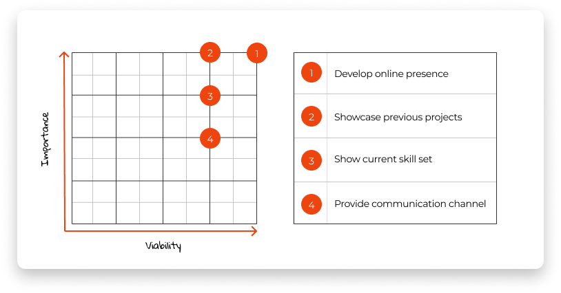
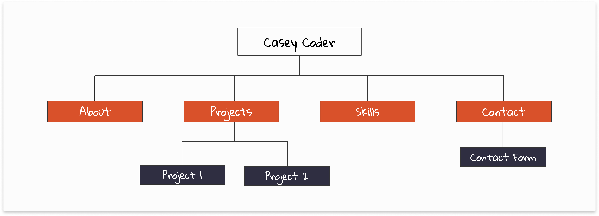
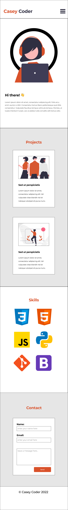
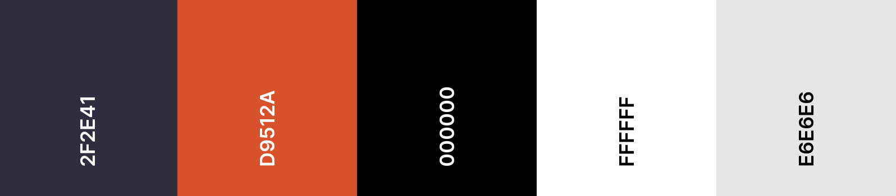

<div align="center">

<h1 style="font-size:40px">Casey Coder</h1>

Mobile-First Demo Project (created for Educational Purposes)

[Live Link](https://github.com/rebeccatraceyt/gitpod-react "Link to Project")

</div>


## Table of contents
1. [UX](#UX)
2. [Technologies Used](#Technologies-Used)
3. [Testing](#Testing)
4. [Deployment](#Deployment)
5. [Credits](#Credits)
5. [Disclaimer](#Disclaimer)

***

## UX 

### User Stories
#### As a visitor, I want to:
1. Easily navigate through the website to find the relevant content, effortlessly.
2. Easily navigate to previous projects of the developer, to learn about their style of work.
3. Easily find a point of contact in order to get in touch with the developer.

### Development Planes

#### Strategy
Broken into three categories, the website will focus on the following target audiences:
- **Roles:**
     - New/Potential Client
     - Current/Returning Clients

- **Demographic:**
     - Potential Employers
     - Interest in collaborating with the developer

- **Psychographics:**
     - Personality & Attitudes:
          - Friendly
          - Outgoing
     - Values:
          - More modern lifestyle
          - Importance of online presence
     - Lifestyles:
          - Business-oriented
          - Client-focused

The website needs to enable the **user** to:
- Retrieve desired information:
     - Previous projects
     - Developer's skill set
     - Contact information

The website needs to enable the **developer** to:
- Develop an online presence 
- Provide an easily navigable website for users to find relevant information:
     - Projects
     - Skills
- Provide a channel of communication for enquires

With these goals in mind, a strategy table was created to determine the trade-off between importance and viability with the following results:

<p align="center">

</p>

#### Scope
A scope was defined in order to clearly identify what needed to be done in order to align features with the strategy previously defined. This was broken into two categories:
- **Content Requirements**
     - The user will be looking for:
          - Biographic information
          - Projects
          - Current skills
          - Contact details

- **Functionality Requirements**
     - The user will be able to:
          - Easily navigate through the site in order to find the information they want
          - Contact the developer directly through their chosen channel of communication

#### Structure
The information architecture was organized in a **hierarchial tree structure** in order to ensure that users could navigate through the site with ease and efficiency, with the following results: 

<p align="center">

</p>

#### Skeleton 
High-Fidelity Wireframe mockups were created in [Figma Workspace](https://www.figma.com/file/amBntIDa2q2qY4SBUtOCQP/hi-fi-wireframes "Link to Portfolio Workspace") with providing a positive user experience in mind:

<div align="center">

</div>

#### Surface

**Colour Scheme**

The chosen colour scheme is reflective of the developers style of creativity. 

<div align="center">

</div>

**Typography**

- The primary font chosen is [Montserrat](https://fonts.google.com/specimen/Montserrat "Link to Montserrat Google Fonts page"). 

     

- The secondary font chosen is [Gloria Hallelujah](https://fonts.google.com/specimen/Gloria+Hallelujah "Link to Gloria Hallelujah Google Fonts page"). 

     


**Imagery**
- The imagery used was sourced from [undraw.co](https://undraw.co/), an open source illustrations library, in order to create a consistency of the elements while maintaining the look and feel of the application.

[Back to top ⇧](#table-of-contents)


## Technologies Used
### Languages Used
- [HTML5](https://en.wikipedia.org/wiki/HTML5 "Link to HTML Wiki")
- [CSS3](https://en.wikipedia.org/wiki/Cascading_Style_Sheets "Link to CSS Wiki")
- [JavaScript](https://en.wikipedia.org/wiki/JavaScript "Link to JavaScript Wiki")
### Tools Used
- [Git](https://git-scm.com/ "Link to Git homepage")
     - Git was used for version control to commit to Git and push to Heroku.
- [GitHub](https://github.com/ "Link to GitHub")
     - GitHub was used to store the project repository, after pushing.
- [Figma](https://www.figma.com/ "Link to Figma homepage")
     - Figma was used to create the wireframes during the design phase of the project.
- [Mockup Generator](https://techsini.com/multi-mockup/index.php "Link Mockup Geneerator Homepage")
     - Am I Responsive was used in order to validate the responsiveness of the design throughout the process, and to generate mockup imagery to be used.
- [Font Awesome](https://fontawesome.com/ "Link to Font Awesome site")
     - Font Awesome was used in conjunction with Iconify for icons used throughout the website.

### Libraries
- [Google Fonts](https://fonts.google.com/ "Link to Google Fonts")
    - Google fonts was used to import the fonts **"Indie Flower"** and **"Work Sans"** into the style.css file. These fonts were used throughout the project.

[Back to top ⇧](#table-of-contents)

## Testing

Testing information can be found in a separate testing [file](TESTING.md "Link to testing file")

## Deployment

To further develop this project, or adapt it for your own portfolio, a clone can be made using the following steps:

*Deployment Instructions assume you are working on a MacOS and may differ on other operating systems. Please check documentation specific for your operating system*

### Prerequisites
To run the project on your own IDE, ensure you have the following:

- An IDE (such as [Visual Studio Code](https://code.visualstudio.com/) or [GitPod](https://www.gitpod.io/))
- [Git](https://git-scm.com/downloads) for project version control
### Local Copy Creation
A Local Clone of the repository can be made in two ways:

#### 1. Forking the Repository:

By forking the GitHub Repository we make a copy of the original repository on our GitHub account to view and/or make changes without affecting the original repository by using the following steps:

1. Log into [GitHub](https://github.com/login "Link to GitHub login page") or [create an account](https://github.com/join "Link to GitHub create account page").
2. Locate the [GitHub Repository](https://github.com/rebeccatraceyt/mobile-first-demo "Link to GitHub Repo").
3. At the top of the repository, on the right side of the page, select "Fork".
4. You should now have a copy of the original repository in your GitHub account.

#### 2. Creating a Clone:
**To run this project locally:**
1. Install the [GitPod Browser](https://www.gitpod.io/docs/browser-extension/ "Link to Gitpod Browser extension download") Extension for Chrome.
2. After installation, restart the browser.
3. Log into [GitHub](https://github.com/login "Link to GitHub login page") or [create an account](https://github.com/join "Link to GitHub create account page").
2. Locate the [GitHub Repository](https://github.com/rebeccatraceyt/mobile-first-demo "Link to GitHub Repo").
5. Click the green "GitPod" button in the top right corner of the repository.
This will trigger a new gitPod workspace to be created from the code in github where you can work locally.

**To run this project within a local IDE (such as VSCode):**
1. Log into [GitHub](https://github.com/login "Link to GitHub login page") or [create an account](https://github.com/join "Link to GitHub create account page").
2. Locate the [GitHub Repository](https://github.com/rebeccatraceyt/mobile-first-demo "Link to GitHub Repo").
3. Under the repository name, click "Clone or download".
4. In the Clone with HTTPs section, copy the clone URL for the repository.
5. In your local IDE open the terminal.
6. Change the current working directory to the location where you want the cloned directory to be made.
7. Type 'git clone', and then paste the URL you copied in Step 3.
     ```
     git clone https://github.com/USERNAME/REPOSITORY
     ```
8. Press Enter. Your local clone will be created.

     *(Further reading and troubleshooting on cloning a repository from GitHub [here](https://docs.github.com/en/free-pro-team@latest/github/creating-cloning-and-archiving-repositories/cloning-a-repository "Link to GitHub troubleshooting"))*


### GitHub Pages Deployment

Once a local clone is created, follow the below steps to deploy locally:
1. Locate the [GitHub Repository](https://github.com/rebeccatraceyt/mobile-first-demo "Link to GitHub Repo").
2. At the top of the repository, select Settings from the menu items.
3. Scroll down the navigation section of the Settings page to the "Pages" section.
4. Under "Source" click the drop-down menu labelled "None" and select **"Master Branch"**.
5. Upon clicking **Save**, the page will automatically refresh meaning that the website is now deployed.
6. The deployed link will now be available.

<div align='center'>
<h2><span style='font-size:20px;'>&#127882;</span> Congratulations! <span style='font-size:20px;'>&#127882;</span> </h2>
<h4>Your project is ready to use. Have fun!</h4>
</div>


[Back to top ⇧](#table-of-contents)

## Credits 

The developer consulted multiple sites in order to better understand the code they were trying to implement. For code that was copied and edited, the developer made sure to reference this with the code. The following sites were used on a more regular basis:
- [Stack Overflow](https://stackoverflow.com/ "Link to Stack Overflow page")
- [W3Schools](https://www.w3schools.com/ "Link to W3Schools page")
- [JSfiddle](https://jsfiddle.net/ "Link to JSfiddle page")

[Back to top ⇧](#table-of-contents)

***

## Disclaimer

This website was created as part of a Code Institute DevLabs Session, with the purpose of demonstrating Mobile-First Design implementation. Therefore, the information provided on [this](https://rebeccatraceyt.github.io/mobile-first-demo/ "Link to live site") site is for general educatinoal purposes, with a fictitious character used for informational purposes.